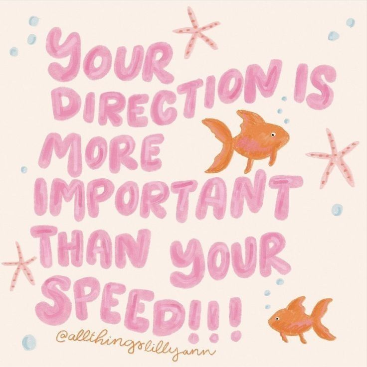

# Images-tutorial
All about image placing !

  

---> This is the central placement. It's used to make your images on the center.
    Perfect to make your image stands out than others.

---> This is the right placement. The text will automatically goes to the left.
     Lovely, right?

     

---> This is the left placement. The text is, expected, goes to right. 

Anyways, that's all ty!! ^^
